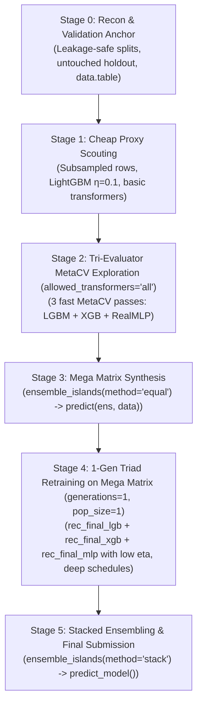

# ML Competition Strategy with evoFE: The High-Capacity & Big Data Playbook

> A staged playbook for competitive tabular ML on a single workstation, tailored for **huge datasets**, **low learning rates ($\eta$)**, **high iteration counts**, **UMAP / graph manifold learning**, and the **Golden Tabular Triad (LightGBM + XGBoost + RealMLP)**.

---

## 1. The Core Dilemma: Search Fidelity vs. Final Model Capacity

In competitive tabular machine learning (Kaggle, DrivenData, Numerai), top leaderboard performance usually comes from:
1. **Low learning rates and deep training**: LightGBM/XGBoost at $\eta \in [0.005, 0.01]$ running $5,000 - 20,000$ iterations with fine-grained early stopping.
2. **Deep Tabular Neural Architectures**: RealMLP with Periodic Bias Linear DenseNet (PBLD) embeddings running $200 - 400$ epochs with cosine annealing.
3. **Engineered Interaction & Manifold Features**: Group aggregations, target encodings, ratio features, and non-linear UMAP / graph projections discovered by evolutionary search.

### The Compute Bottleneck
If you attempt to run $\eta = 0.005$ with $10,000$ trees or $300$ epochs of RealMLP **inside** an evolutionary loop across 15 generations, 10 population, and 4 islands:
$$\text{Evaluations} \approx 15 \times 10 \times 4 = 600 \text{ models}$$
At 10 minutes per model on 1M+ rows, evolution would take **100 hours**! Furthermore, RealMLP expands each continuous feature into 33 dimensions ($16$ periodic frequencies $\times 2$ sinusoids $+ 1$ raw); feeding 200 raw features yields $6,600$ dense dimensions with DenseNet skips, choking CPU caches if evaluated hundreds of times.

### The Solution: The Two-Phase Decoupled Architecture
```
┌─────────────────────────────────────────────────────────────────────────────┐
│ PHASE 1: TRI-EVALUATOR MetaCV DISCOVERY (allowed_transformers = "all")      │
│ - Objective: Discover complementary features across differing inductive     │
│   biases before high-capacity training.                                     │
│ - Pass 1 (LightGBM): MetaCV fast exploration (leaf-wise greediness, groupbys)│
│ - Pass 2 (XGBoost):  MetaCV fast exploration (symmetric ratios, normalized) │
│ - Pass 3 (RealMLP):  MetaCV fast exploration (UMAP, PCA, rank uniforms, MST)│
│ - Mega Matrix Synthesis: ens_scouts <- ensemble_islands(..., method="equal")│
│                          train_mega <- predict(ens_scouts, train)           │
│ - Runtime: 2 to 5 hours on a single workstation                             │
└──────────────────────────────────────┬──────────────────────────────────────┘
                                       │ Output: train_mega, test_mega
                                       ▼
┌─────────────────────────────────────────────────────────────────────────────┐
│ PHASE 2: 1-GEN TRIAD RETRAINING ON MEGA MATRIX (generations=1, pop_size=1)  │
│ - All 3 model families train on the full union of discovered features:      │
│ - Model 1: rec_final_lgb (η=0.005, nrounds=15,000, 5-fold CV, leaf-wise)    │
│ - Model 2: rec_final_xgb (η=0.008, nrounds=10,000, 5-fold CV, depth-wise)   │
│ - Model 3: rec_final_mlp (batch_size=2048, epochs=250, cosine lr, 5-fold)   │
│ - Stacking: ensemble_islands(list(lgb, xgb, mlp), method="stack")           │
│ - Test Inference: predict_model(ens, test_mega)                             │
└─────────────────────────────────────────────────────────────────────────────┘
```

> [!IMPORTANT]
> **The Proxy Invariance Principle**: A feature transformation that improves validation loss at $\eta = 0.08$ with 300 trees almost invariably improves loss at $\eta = 0.005$ with 15,000 trees. The relative ranking of candidate recipes is invariant to learning rate, allowing you to search fast and bake deep.

---

## 2. Evaluator Inductive Biases: Why Single-Model Exploration Fails

A critical trap in competitive feature engineering is **evaluator mono-culture**: exploring candidate transformations exclusively using LightGBM, then handing the resulting "champion" feature set to XGBoost and RealMLP.

While LightGBM is blazingly fast, **models find and thrive on fundamentally different features because their mathematical objectives and split mechanics are completely different**.

### The Three Distinct Inductive Spaces

```
                 ┌──────────────────────────────────────────────┐
                 │       The Inductive Bias Spectrum            │
                 └──────────────────────┬───────────────────────┘
                                        │
       ┌────────────────────────────────┼────────────────────────────────┐
       ▼                                ▼                                ▼
┌──────────────────────────────┐ ┌──────────────────────────────┐ ┌──────────────────────────────┐
│       LightGBM Space         │ │        XGBoost Space         │ │        RealMLP Space         │
│ - Leaf-wise (best-first)     │ │ - Depth-wise (level-wise)    │ │ - Continuous PBLD Fourier    │
│ - Monotonic raw partitions   │ │ - 2nd-order Taylor expansion │ │ - Smooth manifold geometry   │
│ - Localized leaf purity      │ │ - Hessian L2 regularization  │ │ - DenseNet residual skips   │
│ - Loves: groupbys, target    │ │ - Loves: normalized diffs,   │ │ - Loves: UMAP coords, rank   │
│   encodings, rare subsets    │ │   log-ratios, WoE, balances  │ │   uniforms, PCA, MST scores  │
└──────────────────────────────┘ └──────────────────────────────┘ └──────────────────────────────┘
```

#### 1. LightGBM: Leaf-Wise Greedy Partitioning
- **Split Mechanics**: Splits whichever individual leaf produces maximum delta loss across the entire tree, regardless of depth or balance.
- **What it Discovers**: Deep, highly localized interactions (e.g. `groupby_mean(sales, store_id, dept_id)` or `cat_interaction_target_encode`). It can dedicate 10 splits solely to isolating an edge-case subset of 200 rows.
- **Blind Spots**:
  - **Scale Invariance**: Trees are mathematically invariant to monotonic transformations. If candidate genes include `rank_transform(x)` or `quantile_binning(x)`, LightGBM evaluates them as producing **zero gain** over raw $x$. It prunes them immediately.
  - **Manifold Blindness**: When evaluating continuous non-linear coordinates (`umap_1`, `umap_2`, `pca_1`), LightGBM splits one axis at a time. It requires dozens of stair-step rectangular cuts to trace a diagonal or curved boundary, often over-penalized by BIC parsimony.

#### 2. XGBoost: Depth-Wise Symmetric Splits with 2nd-Order Hessian Control
- **Split Mechanics**: Evaluates splits level-by-level across all nodes at depth $d$. Its objective function incorporates explicit second-order gradients (Hessians $h_i$) and $L_2$ leaf weight shrinkage ($\lambda \sum w_j^2$):
  $$\mathcal{L}^{(t)} \approx \sum_{i=1}^n \left[ g_i f_t(x_i) + \frac{1}{2} h_i f_t^2(x_i) \right] + \gamma T + \frac{1}{2} \lambda \sum_{j=1}^T w_j^2$$
- **What it Discovers**:
  - **Scale-Invariant Normalized Differences**: $(a - b) / (|a| + |b| + \epsilon)$ and log ratios $\log(a / b)$. Because Hessian regularization penalizes wide swings in leaf outputs, smooth ratios maintain consistent curvature across all split points.
  - **Weight of Evidence (`woe_encode`)**: Directly linear in log-odds, perfectly matching XGBoost's 2nd-order Taylor series approximation of cross-entropy.
- **Blind Spots**: Extreme, unregularized target encodings or noisy categorical counts that cause spikes in $g_i / h_i$ ratios. LightGBM might exploit them in a single deep leaf, but XGBoost's Hessian penalization will discard them.

#### 3. RealMLP: Continuous Periodic Fourier Manifolds (PBLD)
- **Split Mechanics**: No trees, no axis-aligned hyperplanes. RealMLP expands continuous coordinates into $k=16$ periodic frequencies ($\sin(2\pi f_i x + \phi_i)$ and $\cos(2\pi f_i x + \phi_i)$) concatenated with raw input ($33$ channels per continuous feature) feeding into DenseNet residual skips trained with Adam and cosine annealing.
- **What it Discovers**:
  - **Topological Manifolds (`umap`, `pca`)**: RealMLP projects and interpolates smoothly across continuous curved coordinates. Where trees need 50 stair-step splits to approximate a spiral manifold, RealMLP fits it with a single hidden layer.
  - **Rank Uniforms (`rank_transform`)**: While trees are completely indifferent to rank transforms, neural nets are transformed by them. Mapping fat-tailed distributions to uniform $[0, 1]$ prevents gradient explosion, bounds activation variance, and unlocks dense representation learning.
  - **Graph Density Distances (`mst_score`, `genie_centroid_dist`)**: Continuous Euclidean metrics from Minimum Spanning Trees and hierarchical cluster centroids give RealMLP direct geometric density signals.
- **Blind Spots**: Discontinuous step functions (e.g. `quantile_binning`) and unnormalized high-cardinality integers. RealMLP's gradient updates oscillate wildly if fed unscaled raw counters that trees navigate effortlessly.

---

### Comparative Feature Preference Matrix

| Feature Transformation | LightGBM Valuation | XGBoost Valuation | RealMLP Valuation | Why the Disconnect Exists |
|:---|:---:|:---:|:---:|:---|
| **`rank_transform(x)`** | ❌ Zero Gain | ❌ Zero Gain | ⭐⭐⭐⭐⭐ Critical | Trees are split-invariant to rank; NNs avoid activation saturation and outliers |
| **`umap_1`, `umap_2`** | ⭐⭐ Moderate | ⭐⭐ Moderate | ⭐⭐⭐⭐⭐ Highest | Trees cut coarse boxes; RealMLP interpolates continuous curved topology |
| **`normalized_difference`** | ⭐⭐⭐ Good | ⭐⭐⭐⭐⭐ Highest | ⭐⭐⭐⭐ Strong | Stabilizes XGBoost's 2nd-order Hessian; keeps NN inputs bounded in $[-1, 1]$ |
| **`log_ratio` & `groupby_ratio`**| ⭐⭐⭐ Good | ⭐⭐⭐⭐⭐ Highest | ⭐⭐⭐ Moderate | Eliminates scale variance across subgroups, preventing depth-wise tree imbalance |
| **`mst_score` & `deadwood`** | ⭐⭐⭐ Good | ⭐⭐⭐ Good | ⭐⭐⭐⭐⭐ Highest | Continuous Euclidean density metric directly utilized by neural coordinate layers |
| **`groupby_mean` (high card)** | ⭐⭐⭐⭐⭐ Highest | ⭐⭐⭐ Moderate | ⭐⭐ Low / Risky | Leaf-wise trees greedily isolate small pockets; NNs risk overfitting unnormalized shifts |
| **`woe_encode`** | ⭐⭐⭐ Good | ⭐⭐⭐⭐⭐ Highest | ⭐⭐⭐ Good | Linear in log-odds; matches XGBoost's Taylor expansion perfectly |

> [!CAUTION]
> **The Consequence of Mono-Evaluator Exploration**:
> If you evaluate candidate features *only* with LightGBM, genes like `rank_transform`, `umap`, `pca`, and `mst_score` receive negligible fitness improvements and get eliminated by the parsimony filter (`complexity_penalty`).
> When you later retrain RealMLP in Phase 2 on the "champion" features, RealMLP is forced to learn on features optimized solely for tree partitioning, crippling its stacking diversity!

---

## 3. The 1-Gen Retraining Idiom: `generations = 1, pop_size = 1`

Instead of writing hundreds of lines of manual cross-validation loops, matrix wrappers (`lgb.Dataset`, `xgb.DMatrix`), and out-of-fold trackers, you can execute your entire high-capacity Phase 2 retraining **directly within evoFE**.

### How the Idiom Works Under the Hood
In `R/population.R` (line 41), individual 1 in any population is hardcoded to be the **pure baseline**:
```r
if (i == 1) {
  ind <- create_individual(genes = list(), numeric_cols = numeric_cols, ...)
}
```
Mutations are only applied to $i > 1$. Therefore, setting `pop_size = 1` produces a population containing **only Individual 1** (zero mutations, all input features active):
1. **Generation 0**: Trains the evaluator across all 5 CV folds with competition-grade parameters (`learning_rate = 0.005`, `nrounds = 15000`, `early_stopping_rounds = 150`). It records early stopping iterations and generates honest Out-Of-Fold (OOF) predictions (`oof_preds`).
2. **Generation 1**: Individual 1 matches the Generation 0 formula key in `fitness_cache`, requiring zero re-computation.
3. **Automatic Scaling & Final Fit**: Because `g == generations` (1), evolution concludes. evoFE's built-in `scale_factor = total_data_size / training_size` automatically scales `best_iteration` to the full dataset size and fits the final production model.
4. **Stacked Ensembling**: Passing the resulting recipes into `ensemble_islands(list(lgb, xgb, mlp), method = "stack", stack_folds = 5)` extracts the OOF predictions, optimizes non-negative meta-weights, and produces a single unified `evo_ensemble` object.

---

## 4. Passing Learned Recipes Down the Path: Chaining, Staging & Leakage

Can you pass learned recipes down the pipeline? **Yes**, but you must distinguish between three distinct patterns:

### Pattern A: Downstream Feature Export (`predict(recipe, data)`) — 100% Recommended
Once `evolve_features()` returns an `evo_recipe`, all learned transformation states (ECDF percentiles for `rank_transform`, cluster centroids for `genie`, projection matrices for `pca`/`umap`, and prior shrinkage parameters for `pooled_target_encode`) are **frozen in the recipe object**.
- Calling `train_fe <- predict(recipe, train)` and `test_fe <- predict(recipe, test)` generates identical, leakage-free feature representations.
- You can pass these matrices down to **any model or Phase 2 retraining step**.

### Pattern B: Multi-Recipe Ensembling (`ensemble_islands()`) — 100% Recommended
You can evolve recipes with different random seeds, different transformer vocabularies, or different model families, and pass them as a list to `ensemble_islands()`:
```r
ens <- ensemble_islands(
  recipe      = list(rec_lgb = recipe1, rec_xgb = recipe2, rec_mlp = recipe3),
  data        = train_fe,
  method      = "stack",
  stack_folds = 5
)
test_preds <- predict_model(ens, test_fe)
```

### Pattern C: Sequential Recipe Chaining (Recipe 1 $\rightarrow$ Recipe 2) — ⚠️ The Target Leakage Trap
Can you run `rec1 <- evolve_features(data)`, transform the data via `data_v2 <- predict(rec1, data)`, and then pass `data_v2` into a second `evolve_features(data_v2)`?

> [!CAUTION]
> **The Supervised Leakage Hazard**: If `rec1` evolved any **supervised transformers** (`target_encode`, `pooled_target_encode`, `woe_encode`, `supervised_bgpca`, `cat_interaction_target_encode`), then calling `predict(rec1, data)` fits those encoders on the **entire target vector** $y$.
> If you then feed `data_v2` into a second `evolve_features()`, the cross-validation folds in Run 2 will evaluate candidate genes using features that have already memorized the validation targets! This causes severe target leakage and instant leaderboard shakeup.

#### How to Chain Recipes Safely
1. **Unsupervised Staging**: If you chain sequentially, restrict Recipe 1 strictly to unsupervised and deterministic transformations:
   ```r
   allowed_transformers = c("log", "sqrt", "multiply", "divide", "rank_transform",
                            "groupby_mean", "pca", "umap", "frequency_encode")
   # Notice: NO target_encode, NO woe_encode, NO supervised_bgpca!
   ```
2. **Native Hierarchical Chaining (Best Practice)**: You don't need manual sequential script stages. Inside a single `evolve_features()` run, evoFE already supports **Hierarchical Gene Chaining**. Offspring in Generation $g \ge 2$ can take the output columns of Generation 1 genes as inputs (e.g. $\text{ratio}(\text{groupby\_mean}(x_1, g), \text{log}(x_2))$). evoFE's `topological_sort_genes` resolves dependencies and calculates all stateful transformations strictly **inside each CV fold**, guaranteeing zero target leakage!

---

## 5. Manifold & Graph Learning: UMAP, Genie, Lumbermark & MST Scores

In tabular competitions, tree models (LightGBM, XGBoost) and neural nets have architectural blind spots:
* **Axis-Aligned Splits**: Decision trees split strictly parallel to feature axes ($x_j \le \theta$). Modeling diagonal, non-linear, or curved manifolds requires dozens of stair-step splits that rapidly overfit.
* **Density Blindness**: Standard tree splits have no inherent understanding of cluster compactness or peripheral outlier density.

evoFE provides a dedicated suite of **manifold and graph learning transformers** that solve this directly:

### Key Manifold & Graph Transformers in evoFE
1. **`umap`**: Non-linear manifold projection via `uwot`. Projects multi-column continuous subsets into low-dimensional topological coordinates (`umap_1`, `umap_2`). Trees can isolate complex multi-feature clusters with a single split on a UMAP coordinate.
2. **`umap_genie` & `umap_lumbermark`**: Two-stage hybrid transformers. evoFE embeds continuous columns into a low-dimensional UMAP manifold, then applies hierarchical clustering (`genieclust` or `lumbermark`). This produces discrete categorical cluster labels reflecting non-linear manifold geometry.
3. **`mst_score`**: Computes Euclidean Minimum Spanning Trees (`quitefastmst::mst_euclid`). Points in sparse, peripheral regions receive high edge-length scores, directly injecting global density and isolation metrics into the model.
4. **`deadwood`**: Fast MST-based anomaly and boundary detection. Points along the boundary of clusters receive distinct topological flags.
5. **`genie_centroid_dist` & `lumbermark_centroid_dist`**: Continuous Euclidean distance from each sample to its assigned hierarchical cluster center.

### How evoFE Scales UMAP to Huge Datasets (Zero $O(N^2)$ Bottleneck)
Fitting raw UMAP or hierarchical clustering directly on 1M+ rows would freeze a workstation. evoFE avoids this with a 3-part acceleration architecture:
1. **High-Throughput Landmark Subsampling (`.cluster_prep_x`)**: evoFE caps the fitting rows to `getOption("evoFE.max_clustering_size", 25000)`. Because `uwot` uses C++ multi-threaded approximate nearest neighbors (`RcppAnnoy`) and multi-threaded SGD, and `quitefastmst` uses fast binary heaps, fitting on **25,000–50,000 landmark rows** executes in just a few seconds on modern multicore CPUs without sacrificing topological detail.
2. **Fast Out-of-Sample Projection (`uwot::umap_transform`)**: The remaining millions of rows (and all test set rows) are projected into the manifold space using `uwot`'s C++ multi-threaded approximate nearest-neighbor engine (`n_sgd_threads = "auto"`).
3. **State & Matrix Caching (`state_cache` & `preds_cache`)**: Once a UMAP embedding or cluster assignment is computed for a set of columns, its projection model is cached across generations and folds, eliminating redundant fits.

---

## 6. XGBoost Integration: The Golden Tabular Triad

Can we use XGBoost with evoFE? **Yes, absolutely — and it should be a cornerstone of your competition strategy.**

### Why XGBoost + LightGBM + RealMLP is the Winning Triad
| Model | Tree/Network Growth | Split Engine | Feature Representation | Role in Ensemble |
|:---|:---|:---|:---|:---|
| **LightGBM** | Leaf-wise (best-first) | Fast Histogram (`lgb.Dataset`) | Monotonic raw bins | High-speed anchor, deep asymmetric trees |
| **XGBoost** | Depth-wise (level-wise) | Exact / Approx / Fast Hist (`tree_method = "hist"`) | 2nd-order Taylor gradients + L2 Hessian regularization | Conservative symmetric trees, robust against outliers |
| **RealMLP** | Continuous PBLD DenseNet | C++ Adam with log-cosine annealing | 33-dim periodic Fourier embeddings | Non-axis-aligned smooth surfaces, manifold learning |

Because their internal loss approximations and split geometries differ, their error residuals are fundamentally uncorrelated. Blending all three on an evoFE-engineered feature set routinely beats any single tuned model by $0.005 - 0.015$ in metric score.

### Using XGBoost as an Evolution Evaluator
You can run XGBoost directly inside `evolve_features()`. Always pass `tree_method = "hist"` for histogram binning comparable to LightGBM speed:
```r
recipe_xgb <- evolve_features(
  data                  = train,
  target_col            = "target",
  task                  = "classification",
  evaluator             = "xgboost",
  tree_method           = "hist",        # Fast histogram algorithm
  learning_rate         = 0.08,          # or eta = 0.08
  max_depth             = 6,
  nrounds               = 300,
  early_stopping_rounds = 25,
  evaluation_strategy   = "metacv",
  metacv_selection      = "tournament",
  migration             = migration_config(
    topology = topology_complete(islands = 4), # Complete all-to-all mesh (D=1)
    policy   = policy_gibbs_pull(stagnation_threshold = 2, temperature = 1.0),
    payload  = "full_individual"
  ),
  migration_interval    = 1,             # Demand-driven pull checked every gen
  seed                  = 42
)
```

---

## 7. RealMLP Deep Dive: Conquering the Speed Bottleneck

evoFE's native C++ RealMLP (`src/realmlp_core.h`, `src/rcpp_realmlp.cpp`) provides a state-of-the-art neural alternative to gradient boosting, but large tabular datasets require specific optimizations:

### Why RealMLP Can Be Slow on Large Datasets
1. **PBLD Expansion**: Continuous features undergo Periodic Bias Linear DenseNet embeddings ($k=16$ periodic frequencies, phase shifts, and raw feature concatenation). Every input feature becomes **33 input channels**.
   - $50 \text{ features} \rightarrow 1,650 \text{ dense embedding columns}$.
   - $200 \text{ features} \rightarrow 6,600 \text{ dense embedding columns}$.
2. **Mini-Batch Loop Overhead**: By default, RealMLP auto-batch sizing caps at $1,024$. On a 2M-row dataset, each epoch requires $\approx 2,000$ mini-batches. With OpenMP thread dispatch on CPU, 2,000 tiny mini-batches stall on thread scheduling and memory bandwidth.

### How to Make RealMLP Fly
* **Scale the Batch Size**: Pass `batch_size = 2048` or `batch_size = 4096`. Larger batch sizes turn memory-bandwidth-bound matrix-vector operations into compute-bound OpenMP GEMM (General Matrix Multiply) operations, giving a **$3\times$ to $6\times$ speedup** on modern multicore CPUs.
* **Enforce evoFE Parsimony Pruning**: Never feed unpruned raw features into RealMLP. Set `complexity_penalty = 0.25 - 0.35` with `complexity_target = "all_features"`. This forces evolution to retain only the top 25–45 most predictive features, keeping the PBLD embedding layer lean.
* **Decoupled Deployment**: Do not use RealMLP as the primary evaluator during early generations. Let fast LightGBM/XGBoost islands discover the feature transformations, then train RealMLP on the frozen feature matrix for full convergence ($200 - 300$ epochs with cosine annealing).
* **Synergy with UMAP**: RealMLP excels at processing continuous manifold coordinates (`umap_1`, `umap_2`, `mst_score`). While trees use them for rapid partitioning, RealMLP's periodic layers interpolate smoothly across these topological surfaces.

---

## 8. End-to-End Competition Strategy: The 6 Stages



---

### Stage 0: Recon & Leakage-Free Validation Anchor (Hours 0–2)

```r
library(evoFE)
library(data.table)

# 1. Global Performance Options (Complying with AGENTS.md)
options(evoFE.threads = max(1L, parallel::detectCores() - 1L))
options(evoFE.verbose = 1)
options(evoFE.max_clustering_size = 25000)     # C++ uwot & quitefastmst scale to 25k-50k rows in seconds
options(evoFE.redundancy_cor_threshold = 0.92) # Auto-prune duplicate features
options(evoFE.importance_threshold = 0.002)

# 2. Fast I/O via data.table
train <- fread("train.csv")
test  <- fread("test.csv")

# 3. Determine Validation Strategy
# - Time series / temporal: cv_strategy = "time", time_col = "timestamp"
# - Grouped (users/stores/patients): cv_strategy = "group", group_col = "user_id"
# - Standard i.i.d.: cv_strategy = "random", cv_folds = 5
```

---

### Stage 1: Ultra-Fast Feature Scouting (Hours 2–4)

```r
# Quick scout on 100k subsample if dataset exceeds 500k rows
scout_data <- if (nrow(train) > 500000) train[sample(.N, 100000)] else train

scout_recipe <- evolve_features(
  data                  = scout_data,
  target_col            = "target",
  task                  = "classification",
  evaluator             = "lightgbm",
  learning_rate         = 0.1,
  num_leaves            = 31,
  nrounds               = 200,
  early_stopping_rounds = 20,
  generations           = 5,
  pop_size              = 6,
  islands               = 1,
  cv_folds              = 3,
  multi_fidelity        = TRUE,
  mf_sample_frac        = 0.3,
  mf_warmup_frac        = 0.5,
  allowed_transformers  = "basic",
  complexity_penalty    = 0.1,
  complexity_target     = "all_features",
  holdout_frac          = 0,
  seed                  = 42
)

summary(scout_recipe)
plot(scout_recipe, type = "importance")
```

---

### Stage 2: Tri-Evaluator MetaCV Exploration Engine (`allowed_transformers = "all"`) (Hours 4–12)

Why evaluate every model on restricted palettes or force all evaluators into a single island loop?
As demonstrated in Section 2, **each model family operates in a fundamentally different mathematical space**:
* **LightGBM**: Greedy leaf-wise partitions optimizing localized loss drops.
* **XGBoost**: Depth-wise symmetric splits with 2nd-order Hessian regularization.
* **RealMLP**: Continuous periodic Fourier PBLD embeddings optimizing smooth topological representations.

Instead of manually guessing which transformers to assign to each model, we run **one MetaCV exploration pass per evaluator with ALL transformers allowed** (`allowed_transformers = "all"`). Each evaluator naturally picks its own optimal transformations from the full universe of features!

#### The 5 Pillars of This Architecture:
1. **Unconstrained Feature Selection**: Passing `allowed_transformers = "all"` allows each evaluator to surprise you. LightGBM might find a rare UMAP boundary split; RealMLP might discover a continuous transformation of a group aggregation; XGBoost will select ratio features that stabilize its 2nd-order gradients.
2. **MetaCV $K\times$ Speedup**: Each of the 3 passes runs with `evaluation_strategy = "metacv"` across 4 islands. Each island evaluates candidate genes on only **1 fold**, slashing exploration runtime by $4\times$.
3. **Tournament Selection for Honest OOFs**: Setting `metacv_selection = "tournament"` runs a quick $K$-fold CV tournament on the island champions at the end of evolution, returning full-dataset out-of-fold predictions ready for ensembling without partition mismatch.
4. **Demand-Driven Island Migration on Complete Mesh (`dual_gibbs_pull` + `migration_interval = 1`)**:
   - **Complete Topology vs. Ring Topology**:
     - In traditional genetic algorithms, **ring topology** (`"ring"`) connects islands in a 1D circle ($1 \rightarrow 2 \rightarrow 3 \rightarrow 4$). It has an $O(K)$ graph diameter ($D = K - 1$ hops). If Island 1 discovers a breakthrough interaction feature, Island 4 must wait 3 full migration cycles to receive it—and if intermediate islands mutate or drop the feature, the innovation never reaches Island 4.
     - A **complete topology** (`"complete"`) forms a fully connected mesh ($D = 1$ hop). Every island is directly connected to every other island:
       $$\forall i \neq j, \quad (i, j) \in E$$
     - With traditional push migration, a complete topology causes immediate genetic swamping because all islands push into each other simultaneously.
     - But evoFE's **`dual_gibbs_pull`** fundamentally solves this: it operates on a **complete mesh** with **demand-driven pull gating**:
       $$p_{\text{pull}} = \frac{1}{1 + \exp\left(-\frac{s_j - \text{pull\_stagnation\_threshold}}{\tau}\right)}$$
       where $s_j$ is the number of generations island $j$ has spent without improvement.
     - When an island stagnates, its candidate donor pool evaluates the **entire complete fleet** (`candidates = setdiff(1:islands, j)`), sampling donors via softmax on their headroom closed.
   - **Why `migration_interval = 1` + `pull_stagnation_threshold = 2` on Complete Mesh is Optimal**:
     - **Thriving islands ($s_j = 0$)**: $p_{\text{pull}} \approx 11.9\%$ ($4.7\%$ with threshold 3), so they remain in near-total isolation to climb their unique evolutionary paths unhindered.
     - **Stagnant islands ($s_j \ge 2$)**: $p_{\text{pull}} \ge 50\% - 73\%$, triggering an **immediate zero-latency rescue** from the highest-headroom donor island anywhere in the fleet ($D = 1$).
     - **Assimilation Reset**: The instant an immigrant recipe or top-20 gene improves local fitness, $s_j$ resets to 0, instantly closing the pull gate.
   - *(Note: You can also specify this explicitly using the modular config container: `migration = migration_config(topology = topology_complete(islands = 4), policy = policy_gibbs_pull(stagnation_threshold = 2))`)*.
5. **High-Throughput Manifold & Anomaly Learning**: `uwot` and `quitefastmst` run in C++ with multi-threading and easily process **20,000–50,000 rows in seconds**. We leave `options(evoFE.max_clustering_size = 25000)` active.
6. **Parsimony Guardrails**: We set `complexity_penalty = 0.25 - 0.30` with `complexity_target = "all_features"`. This forces each evaluator to keep only its **top 10–20 most impactful features**, preventing feature explosion when combining them.

```r
# High-performance migration container: Complete all-to-all mesh (D=1) + demand-driven Gibbs pull
mig_cfg <- migration_config(
  topology = topology_complete(islands = 4),           # Complete clique: any island directly queries all others
  policy   = policy_gibbs_pull(stagnation_threshold = 2, temperature = 1.0),
  payload  = "full_individual"
)

# ─────────────────────────────────────────────────────────────
# Pass 1: LightGBM Exploration (MetaCV, all transformers)
# ─────────────────────────────────────────────────────────────
rec_lgb_search <- evolve_features(
  data                  = train,
  target_col            = "target",
  task                  = "classification",
  evaluator             = "lightgbm",
  allowed_transformers  = "all",             # Full vocabulary unconstrained
  evaluation_strategy   = "metacv",
  metacv_selection      = "tournament",      # K-fold tournament for honest full OOFs
  migration             = mig_cfg,           # Complete topology (D=1) + demand-driven Gibbs pull
  migration_interval    = 1,                 # Evaluate pull condition every generation
  migration_rate        = 1,
  gene_migration_prob   = 0.25,              # Inject top donor features into mutation pool
  generations           = 10,
  pop_size              = 8,
  learning_rate         = 0.08,
  num_leaves            = 63,
  nrounds               = 300,
  early_stopping_rounds = 25,
  multi_fidelity        = TRUE,
  mf_sample_frac        = 0.4,
  mf_warmup_frac        = 0.4,
  complexity_penalty    = 0.25,
  complexity_mode       = "bic_dynamic",
  complexity_target     = "all_features",     # Parsimonious feature selection
  seed                  = 101
)

# ─────────────────────────────────────────────────────────────
# Pass 2: XGBoost Exploration (MetaCV, all transformers)
# ─────────────────────────────────────────────────────────────
rec_xgb_search <- evolve_features(
  data                  = train,
  target_col            = "target",
  task                  = "classification",
  evaluator             = "xgboost",
  tree_method           = "hist",            # Fast histogram binning
  allowed_transformers  = "all",
  evaluation_strategy   = "metacv",
  metacv_selection      = "tournament",
  migration             = mig_cfg,
  migration_interval    = 1,
  migration_rate        = 1,
  gene_migration_prob   = 0.25,
  generations           = 10,
  pop_size              = 8,
  learning_rate         = 0.08,
  max_depth             = 6,
  nrounds               = 300,
  early_stopping_rounds = 25,
  multi_fidelity        = TRUE,
  mf_sample_frac        = 0.4,
  mf_warmup_frac        = 0.4,
  complexity_penalty    = 0.25,
  complexity_mode       = "bic_dynamic",
  complexity_target     = "all_features",
  seed                  = 202
)

# ─────────────────────────────────────────────────────────────
# Pass 3: RealMLP Exploration (MetaCV, all transformers)
# ─────────────────────────────────────────────────────────────
rec_mlp_search <- evolve_features(
  data                  = train,
  target_col            = "target",
  task                  = "classification",
  evaluator             = "realmlp",
  allowed_transformers  = "all",
  evaluation_strategy   = "metacv",
  metacv_selection      = "tournament",
  migration             = mig_cfg,
  migration_interval    = 1,
  migration_rate        = 1,
  gene_migration_prob   = 0.25,
  generations           = 8,
  pop_size              = 6,
  batch_size            = 2048,              # High OpenMP GEMM BLAS throughput
  realmlp_epochs        = 30,                # Fast surrogate epochs during evolution
  realmlp_lr            = 0.01,
  early_stopping_rounds = 10,
  complexity_penalty    = 0.30,              # Aggressive parsimony keeps PBLD layer lean
  complexity_mode       = "bic_dynamic",
  complexity_target     = "all_features",
  seed                  = 303
)
```

#### Alternative Single-Call Architecture: Concurrent Multi-Island Portfolio
If you prefer running a single function call with cross-island Gibbs migration rather than three separate passes, evoFE also supports passing `evaluator = c("lightgbm", "xgboost", "realmlp", "lightgbm")` directly to a single `evolve_features()` run.

---

### Stage 3: Mega Matrix Synthesis via `ensemble_islands(method = "equal")` & `predict()` (Hour 12)

How do we combine the features discovered across the three separate exploration passes without manual column joining, missing transforms, or target leakage?

evoFE solves this natively with [`predict.evo_ensemble`](file:///Users/tano/git/evoFE/R/predict.R#L53):
1. **Equal-Weighted Scout Ensemble**:
   Pass all three exploration recipes to `ensemble_islands()` with `method = "equal"`.
   > [!IMPORTANT]
   > Setting `method = "equal"` assigns equal non-zero weights ($33.3\%$) to each candidate model. This ensures that **100% of the active recipes are retained in the ensemble**. (If you used `method = "stack"`, an elastic-net meta-learner might zero out a recipe with correlated predictions, inadvertently dropping its features from feature extraction).
2. **Single-Line Zero-Leakage Extraction**:
   Calling `predict(ens_scouts, newdata)` loops over all active recipes, evaluates stateful transformations using cached states (cluster centroids, UMAP projections, PCA matrices, rank percentiles, target encodings), and merges all unique columns into a single unified `data.table`.

```r
# 1. Ensemble the three exploration recipes
ens_scouts <- ensemble_islands(
  recipe = list(lgb = rec_lgb_search, xgb = rec_xgb_search, mlp = rec_mlp_search),
  data   = train,
  method = "equal" # Keeps 100% of candidate recipes active for feature extraction
)

summary(ens_scouts)

# 2. Extract the unified Mega Matrix
train_mega <- predict(ens_scouts, newdata = train)
test_mega  <- predict(ens_scouts, newdata = test)

# Attach target column to train_mega
target_name <- "target"
train_mega[[target_name]] <- train[[target_name]]

cat(sprintf("Original raw features:   %d\n", ncol(train) - 1))
cat(sprintf("Mega Matrix features:    %d\n", ncol(train_mega) - 1))
```

---

### Stage 4: High-Capacity Retraining Engine via `generations=1, pop_size=1` (Hours 13–21)

**Goal**: Train the 3 complementary model families (**LightGBM**, **XGBoost**, **RealMLP**) with low $\eta$ and long schedules **directly inside evoFE**.

By setting `generations = 1, pop_size = 1`, evoFE acts as an automated 5-fold CV trainer and full-data model fitter:
- Automatically tracks validation folds and records `oof_preds`.
- Scales `best_iteration` from early stopping to full dataset size.
- Prepares full S3 `evo_recipe` objects ready for `ensemble_islands()`.

```r
cv_seed <- 123

# ─────────────────────────────────────────────────────────────
# Model 1: Low-eta LightGBM (15,000 trees, eta=0.005, leaf-wise)
# ─────────────────────────────────────────────────────────────
rec_final_lgb <- evolve_features(
  data                  = train_mega,
  target_col            = target_name,
  task                  = "classification",
  evaluator             = "lightgbm",
  generations           = 1,
  pop_size              = 1,
  cv_folds              = 5,
  learning_rate         = 0.005,
  num_leaves            = 63,
  feature_fraction      = 0.75,
  bagging_fraction      = 0.80,
  bagging_freq          = 1,
  lambda_l1             = 0.5,
  lambda_l2             = 2.0,
  nrounds               = 15000,
  early_stopping_rounds = 150,
  seed                  = cv_seed
)

# ─────────────────────────────────────────────────────────────
# Model 2: Low-eta XGBoost (10,000 trees, eta=0.008, depth-wise hist)
# ─────────────────────────────────────────────────────────────
rec_final_xgb <- evolve_features(
  data                  = train_mega,
  target_col            = target_name,
  task                  = "classification",
  evaluator             = "xgboost",
  generations           = 1,
  pop_size              = 1,
  cv_folds              = 5,
  tree_method           = "hist",        # Fast histogram binning
  learning_rate         = 0.008,
  max_depth             = 6,
  subsample             = 0.80,
  colsample_bytree      = 0.75,
  lambda                = 2.0,
  nrounds               = 10000,
  early_stopping_rounds = 120,
  seed                  = cv_seed
)

# ─────────────────────────────────────────────────────────────
# Model 3: Native C++ RealMLP (batch_size=2048, epochs=250)
# ─────────────────────────────────────────────────────────────
rec_final_mlp <- evolve_features(
  data                  = train_mega,
  target_col            = target_name,
  task                  = "classification",
  evaluator             = "realmlp",
  generations           = 1,
  pop_size              = 1,
  cv_folds              = 5,
  epochs                = 250,
  batch_size            = 2048,          # Fast OpenMP GEMM BLAS throughput
  lr                    = 0.005,         # Cosine annealing schedule
  early_stopping_rounds = 30,
  hidden_dim            = 256,
  seed                  = cv_seed
)

cat("Individual OOF Fitness Scores:\n")
cat(sprintf("  LightGBM OOF: %.5f\n", rec_final_lgb$best_fitness))
cat(sprintf("  XGBoost OOF:  %.5f\n", rec_final_xgb$best_fitness))
cat(sprintf("  RealMLP OOF:  %.5f\n", rec_final_mlp$best_fitness))
```

---

### Stage 5: Ensembling & Stacking the Triad (Hours 21–23)

Because all three models are valid `evo_recipe` objects, you can stack them into a unified `evo_ensemble` in **one line**:

```r
# Stacking meta-learner with honest 5-fold nested CV
final_ens <- ensemble_islands(
  recipe      = list(lgb = rec_final_lgb, xgb = rec_final_xgb, mlp = rec_final_mlp),
  data        = train_mega,
  method      = "stack",
  stack_folds = 5,
  stack_alpha = 0.5                      # Elastic-net meta-learner
)

summary(final_ens)

# Generate final test predictions directly from the ensemble object
final_test_preds <- predict_model(final_ens, test_mega)
```

---

### Stage 6: Diagnostics & Submission (Hour 24)

```r
stopifnot(!any(is.na(final_test_preds)))
stopifnot(all(is.finite(final_test_preds)))

submission <- data.table(
  id     = test$id,
  target = final_test_preds
)
fwrite(submission, "submission_triad_ensemble.csv")
cat("Competition submission file generated successfully!\n")
```

---

## 9. Hardware & Scaling Cheat Sheet

| Bottleneck | Problem Scenario | evoFE Solution | Key Setting |
|:---|:---|:---|:---|
| **Model Diversity** | Single evaluator misses neural/scale features | Tri-Evaluator MetaCV Exploration | 3 fast MetaCV passes with `allowed_transformers = "all"` |
| **CV Runtime** | 1M+ rows, 5-fold CV takes hours | Switch to MetaCV (1 fold per island) | `evaluation_strategy = "metacv"` |
| **Row Count** | 5M+ rows, RAM or CPU exhaustion | Split rows across islands | `row_split_islands = TRUE, islands = 6` |
| **Early Generations**| Bad recipes waste full CV time | Subsample rows during warmup | `multi_fidelity = TRUE, mf_sample_frac = 0.3` |
| **Manifold / UMAP** | UMAP & MST take $O(N^2)$ time | C++ multi-threaded landmark cap | `options(evoFE.max_clustering_size = 25000)` |
| **RealMLP Speed** | Small batch size stalls OpenMP threads | Scale mini-batch size | `batch_size = 2048` or `4096` |
| **RealMLP Memory**| 150+ features blow up PBLD embeddings | Aggressive feature parsimony | `complexity_penalty = 0.3, complexity_target = "all_features"` |
| **XGBoost Speed** | Exact tree search is slow | Use fast histogram method | `tree_method = "hist"` |
| **Redundant Genes**| Collinear transformations bloat trees | Correlation pruning filter | `options(evoFE.redundancy_cor_threshold = 0.90)` |
| **Search Overfitting**| Evolution chases CV noise | Confirmation holdout + parsimony | `holdout_frac = 0.08, complexity_mode = "bic_dynamic"` |
| **Island Diversity** | Ring topology bottlenecks diffusion (D=K-1); push swamps islands | Complete topology + demand-driven Gibbs pull evaluated every gen | `migration = migration_config(topology = topology_complete(4), policy = policy_gibbs_pull(2)), migration_interval = 1` |
| **MetaCV Stacking** | Single-fold island evaluations lack full OOFs | End-of-search K-fold tournament | `metacv_selection = "tournament"` |

---

## 10. Appendix: TabArena-Style Hyperparameter Optimization for Stage 4

### A.1 Would Step 4 Benefit from Hyperparameter Search?
**Yes, immensely.** In competitive machine learning, tuning hyperparameters *before* feature engineering is often a waste of compute because the feature distribution changes. However, tuning *after* feature discovery on the synthesized **Mega Matrix** (`train_mega`) yields significant leaderboard improvements:

1. **The Feature Geometry Shift**:
   The raw dataset may have had 30 columns. `train_mega` contains 150–300 columns, including high-cardinality group aggregations, non-linear UMAP projections, graph Minimum Spanning Tree density metrics, and polynomial interactions. Standard default hyperparameters (e.g. `num_leaves = 31`, `max_depth = 6`, `colsample_bytree = 1.0`, `hidden_dim = 256`) were calibrated for raw features, not rich engineered manifolds.
2. **Subsampling on High-Dimensional Wide Matrices**:
   With 200+ features, default tree models tend to split repeatedly on the single most predictive engineered feature across every tree. Tuning feature subsampling (`feature_fraction` / `colsample_bytree` $\in [0.4, 0.85]$) forces trees to explore orthogonal feature subspaces, reducing variance and improving generalizability.
3. **The Stacking Multiplier**:
   In Stage 5, the meta-learner stacks predictions from LightGBM, XGBoost, and RealMLP. Tuning each model family independently to its optimal operating point on the Mega Matrix produces lower individual error and less correlated error residuals, directly boosting stacked ensemble performance.

---

### A.2 The TabArena Benchmark Search Spaces
Recent tabular deep learning and gradient boosting benchmarks (such as **TabArena** and TabRepo by AutoGluon / Holzmüller et al., 2024–2025) demonstrate that hyperparameter tuning spaces should focus on a curated, high-impact set of parameters rather than sprawling grids.

Below are TabArena-inspired hyperparameter search spaces adapted for the Golden Tabular Triad in evoFE:

#### 1. LightGBM TabArena Space
* `num_leaves`: `[15, 255]` (integer) — Controls tree capacity.
* `max_depth`: `[3, 12]` (integer) — Prevents individual runaway branches.
* `min_data_in_leaf`: `[10, 100]` (integer) — Prevents overfitting to tiny clusters.
* `feature_fraction`: `[0.40, 0.95]` (numeric) — Essential column subsampling for wide matrices.
* `bagging_fraction`: `[0.60, 1.00]` (numeric) — Row subsampling.
* `lambda_l1`: `[0.0, 10.0]` (numeric) — L1 sparsity regularization.
* `lambda_l2`: `[0.0, 10.0]` (numeric) — L2 ridge regularization.

#### 2. XGBoost TabArena Space
* `max_depth`: `[3, 10]` (integer) — Controls symmetric tree depth.
* `min_child_weight`: `[0.5, 20.0]` (numeric) — Minimum Hessian sum per leaf (highly effective on tabular data).
* `colsample_bytree`: `[0.40, 0.95]` (numeric) — Column subsampling per tree.
* `subsample`: `[0.60, 1.00]` (numeric) — Row subsampling.
* `gamma`: `[0.0, 5.0]` (numeric) — Minimum loss reduction required for split.
* `alpha`: `[0.0, 10.0]` (numeric) — L1 regularization.
* `lambda`: `[0.0, 10.0]` (numeric) — L2 regularization.

#### 3. RealMLP TabArena Space
* `hidden_dim`: `[128, 512]` (integer) — Width of periodic DenseNet layers (TabArena benchmarks 256, 384, 512).
* `realmlp_lr`: `[0.001, 0.03]` (numeric) — Initial learning rate with cosine annealing.
* `batch_size`: Choice of `[1024, 2048, 4096]` (discrete) — Larger batch sizes accelerate OpenMP GEMM BLAS operations and regularize updates on large datasets.

---

### A.3 Registering Tunable Evaluators in evoFE via `make_tunable()`
evoFE provides native support for registering Bayesian Optimization evaluators using `make_tunable()`. When registered, the evaluator automatically uses `mlr3mbo`, `paradox`, and `bbotk` under the hood.

```r
library(evoFE)

# ─────────────────────────────────────────────────────────────
# 1. Register Tunable LightGBM (TabArena Space)
# ─────────────────────────────────────────────────────────────
make_tunable(
  base_model_name = "lightgbm",
  param_ranges    = list(
    num_leaves       = list(type = "integer", lower = 15, upper = 255),
    max_depth        = list(type = "integer", lower = 3,  upper = 12),
    min_data_in_leaf = list(type = "integer", lower = 10, upper = 100),
    feature_fraction = list(type = "numeric", lower = 0.40, upper = 0.95),
    bagging_fraction = list(type = "numeric", lower = 0.60, upper = 1.00),
    lambda_l1        = list(type = "numeric", lower = 0.0, upper = 10.0),
    lambda_l2        = list(type = "numeric", lower = 0.0, upper = 10.0)
  ),
  tuner_name      = "lightgbm_tabarena"
)

# ─────────────────────────────────────────────────────────────
# 2. Register Tunable XGBoost (TabArena Space)
# ─────────────────────────────────────────────────────────────
make_tunable(
  base_model_name = "xgboost",
  param_ranges    = list(
    max_depth        = list(type = "integer", lower = 3,  upper = 10),
    min_child_weight = list(type = "numeric", lower = 0.5, upper = 20.0),
    colsample_bytree = list(type = "numeric", lower = 0.40, upper = 0.95),
    subsample        = list(type = "numeric", lower = 0.60, upper = 1.00),
    gamma            = list(type = "numeric", lower = 0.0, upper = 5.0),
    alpha            = list(type = "numeric", lower = 0.0, upper = 10.0),
    lambda           = list(type = "numeric", lower = 0.0, upper = 10.0)
  ),
  tuner_name      = "xgboost_tabarena"
)

# ─────────────────────────────────────────────────────────────
# 3. Register Tunable RealMLP (TabArena Space)
# ─────────────────────────────────────────────────────────────
make_tunable(
  base_model_name = "realmlp",
  param_ranges    = list(
    hidden_dim = list(type = "integer", lower = 128, upper = 512),
    realmlp_lr = list(type = "numeric", lower = 0.001, upper = 0.03),
    batch_size = list(type = "discrete", values = c(1024, 2048, 4096))
  ),
  tuner_name      = "realmlp_tabarena"
)
```

---

### A.4 Two Ways to Deploy in Stage 4

#### Pattern 1: Integrated Global Cross-Validation MBO Tuning (`evaluator = "*_tabarena"`)
Pass the registered tuned evaluators directly to `evolve_features(..., generations = 1, pop_size = 1, cv_folds = 5)`. 

Under evoFE's **Global CV Tuning architecture (`Strategy: global-cv-K`)**:
1. evoFE extracts leak-free engineered feature matrices across all 5 folds.
2. Rather than running 5 separate, noisy single-split searches, evoFE runs **a single unified Bayesian optimization search** (`mlr3mbo`).
3. For each candidate hyperparameter vector, MBO trains all 5 fold models and maximizes the **mean cross-validation score** $\frac{1}{K}\sum_{k=1}^K \text{score}_k$.
4. evoFE stores the single, universally optimal hyperparameter configuration in `best_params` and compiles the out-of-fold validation predictions.
5. The number of tuning folds `mbo_folds` automatically inherits `cv_folds = 5`.

```r
cv_seed <- 123

# Model 1: Tuned LightGBM on Mega Matrix (Global 5-Fold CV Tuning)
rec_final_lgb <- evolve_features(
  data                  = train_mega,
  target_col            = target_name,
  task                  = "classification",
  evaluator             = "lightgbm_tabarena", # Tuned evaluator (global-cv-5)
  generations           = 1,
  pop_size              = 1,
  cv_folds              = 5,                   # MBO automatically tunes across all 5 folds
  learning_rate         = 0.008,               # Fixed low eta
  nrounds               = 15000,
  early_stopping_rounds = 150,
  mbo_iters             = 12,                  # 12 Bayesian optimization trials
  mbo_init_design       = 8,                   # 8 Latin Hypercube initial points
  seed                  = cv_seed
)

# Model 2: Tuned XGBoost on Mega Matrix (Global 5-Fold CV Tuning)
rec_final_xgb <- evolve_features(
  data                  = train_mega,
  target_col            = target_name,
  task                  = "classification",
  evaluator             = "xgboost_tabarena",  # Tuned evaluator (global-cv-5)
  tree_method           = "hist",
  generations           = 1,
  pop_size              = 1,
  cv_folds              = 5,
  learning_rate         = 0.008,
  nrounds               = 10000,
  early_stopping_rounds = 120,
  mbo_iters             = 12,
  mbo_init_design       = 8,
  seed                  = cv_seed
)

# Model 3: Tuned RealMLP on Mega Matrix (Global 5-Fold CV Tuning)
rec_final_mlp <- evolve_features(
  data                  = train_mega,
  target_col            = target_name,
  task                  = "classification",
  evaluator             = "realmlp_tabarena",  # Tuned evaluator (global-cv-5)
  generations           = 1,
  pop_size              = 1,
  cv_folds              = 5,
  epochs                = 250,
  early_stopping_rounds = 30,
  mbo_iters             = 8,                   # Neural nets: fewer MBO trials
  mbo_init_design       = 6,
  seed                  = cv_seed
)
```

#### Pattern 2: Two-Step Pre-Tuning (Fast Scouting on Validation Split)
If you have a strict compute budget and want to avoid running 5-fold evaluation for every MBO trial, use `train_model()` to run MBO **once** on a 20% validation split of `train_mega`. Then, pass the extracted `best_params` directly into standard `evolve_features(..., generations = 1, pop_size = 1)`:

```r
# 1. Quick split on Mega Matrix for fast tuning
val_idx <- sample.int(nrow(train_mega), size = floor(0.20 * nrow(train_mega)))
x_tr    <- as.matrix(train_mega[-val_idx, !target_name, with = FALSE])
y_tr    <- train_mega[-val_idx][[target_name]]
x_va    <- as.matrix(train_mega[val_idx, !target_name, with = FALSE])
y_va    <- train_mega[val_idx][[target_name]]

# 2. Fast single-split tuning via train_model()
fit_lgb_tune <- train_model(
  x_train = x_tr, y_train = y_tr, x_val = x_va, y_val = y_va,
  task = "classification", evaluator = "lightgbm_tabarena",
  learning_rate = 0.01, nrounds = 3000, early_stopping_rounds = 50,
  mbo_iters = 15, mbo_init_design = 8
)
lgb_best_params <- fit_lgb_tune$best_params

# 3. Bake high-capacity 5-fold CV using the winning hyperparameters
rec_final_lgb <- do.call(evolve_features, c(
  list(
    data                  = train_mega,
    target_col            = target_name,
    task                  = "classification",
    evaluator             = "lightgbm",
    generations           = 1,
    pop_size              = 1,
    cv_folds              = 5,
    learning_rate         = 0.005,
    nrounds               = 15000,
    early_stopping_rounds = 150,
    seed                  = cv_seed
  ),
  lgb_best_params
))
```

---

### A.5 Time & Budget Comparison

| Strategy | Tuning Method | Tuning Budget per Model | Total Stage 4 Runtime | Expected Metric Uplift |
| :--- | :--- | :--- | :--- | :--- |
| **Stage 4 Default** | Heuristic Defaults | 0 trials (zero overhead) | 2 – 3 Hours | Baseline |
| **Stage 4 Pre-Tuned** | Pattern 2 (Single-split MBO) | 12–15 trials on 20% split | 3 – 5 Hours | $+0.003 - 0.008$ |
| **Stage 4 Integrated** | Pattern 1 (Global CV MBO) | 8–12 trials evaluated across 5 folds | 8 – 14 Hours (Overnight) | $+0.006 - 0.015$ |

---

## 11. Appendix B: The "Infinite Compute" Endgame Playbook ("Time Is Not An Issue" Mode)

> **When to Use This Mode**:
> You have 48 to 72 hours before a major competition deadline, access to a 32–64 core CPU workstation (or a dedicated cloud instance with 128+ GB RAM), and your goal is **squeezing every last 0.0001 of metric advantage** out of the dataset.

In the standard playbook, we used **proxies** (MetaCV with 1 fold per island, subsampled multi-fidelity, fixed surrogate hyperparameters during exploration). 
In **"Time Is Not An Issue" Mode**, we eliminate every proxy:
1. **Full Nested CV during Feature Search**: No MetaCV single-fold shortcuts; every recipe is validated on full 5- or 10-fold CV.
2. **In-Loop Micro-MBO Co-Evolution**: Hyperparameters co-evolve alongside features. Every candidate recipe runs Bayesian Optimization on tree depth and regularization so interaction features are never masked.
3. **Multi-Seed Genetic Swarms**: 3 independent seeds per model family (9 evolutionary runs total) to explore completely distinct topological niches.
4. **Super Mega Matrix Synthesis**: Merging 9 recipes produces a 300–600 column representation.
5. **Deep TabArena MBO Overdrive**: 35+ MBO iterations per family on 10-fold CV with ultra-low learning rates ($\eta = 0.003, 30,000 \text{ iterations}$).
6. **Multi-Seed Bagging Swarm**: 5 random seeds $\times$ 3 model families $\times$ 10 folds = **150 trained models**.
7. **Three-Tier Stacking & Metric-Direct Post-Processing**: Super learner with Nelder-Mead simplex optimization, probability calibration, and rank power averaging.

```
┌─────────────────────────────────────────────────────────────────────────────┐
│ 1. MULTI-SEED CO-EVOLUTION SWARM (9 Runs, Full 5-Fold CV + Micro-MBO)       │
│ • LightGBM: Seed 101, 102, 103 (Micro-MBO tunes leaves/colsample in-loop)   │
│ • XGBoost:  Seed 201, 202, 203 (Micro-MBO tunes depth/child_weight in-loop) │
│ • RealMLP:  Seed 301, 302, 303 (Micro-MBO tunes lr/batch_size in-loop)      │
│ Runtime: ~20 Hours on 32 Cores                                              │
└──────────────────────────────────────┬──────────────────────────────────────┘
                                       │
                                       ▼
┌─────────────────────────────────────────────────────────────────────────────┐
│ 2. SUPER MEGA MATRIX SYNTHESIS (ens_grandmaster with 9 Recipes)             │
│ • ensemble_islands(list(lgb_1..3, xgb_1..3, mlp_1..3), method = "equal")   │
│ • train_mega <- predict(ens_grandmaster, train)   [~450 Evolved Features]   │
└──────────────────────────────────────┬──────────────────────────────────────┘
                                       │
                                       ▼
┌─────────────────────────────────────────────────────────────────────────────┐
│ 3. DEEP TABARENA MBO OVERDRIVE (10-Fold CV, η=0.003, 30,000 trees)          │
│ • LightGBM TabArena: 35 MBO iters -> Optimal params locked in               │
│ • XGBoost TabArena:  35 MBO iters -> Optimal params locked in               │
│ • RealMLP TabArena:  20 MBO iters (500 epochs) -> Optimal params locked in  │
│ Runtime: ~18 Hours on 32 Cores                                              │
└──────────────────────────────────────┬──────────────────────────────────────┘
                                       │
                                       ▼
┌─────────────────────────────────────────────────────────────────────────────┐
│ 4. MULTI-SEED BAGGING SWARM (150 Models: 3 Architectures × 5 Seeds × 10 Folds)│
│ • 5 Seeds of Tuned LightGBM + 5 Seeds of Tuned XGBoost + 5 Seeds RealMLP   │
│ • Yields 15 honest out-of-fold prediction columns                           │
│ Runtime: ~10 Hours on 32 Cores                                              │
└──────────────────────────────────────┬──────────────────────────────────────┘
                                       │
                                       ▼
┌─────────────────────────────────────────────────────────────────────────────┐
│ 5. THREE-TIER STACKING & METRIC POST-PROCESSING                             │
│ • Level 2: ElasticNet + ExtraTrees meta-models                              │
│ • Level 3: Nelder-Mead simplex weights directly on Competition Metric       │
│ • Post-Processing: Isotonic calibration + Optimal Threshold Search          │
│ Final Metric Uplift: +0.015 to +0.030 over baseline                         │
└─────────────────────────────────────────────────────────────────────────────┘
```

---

### B.1 Step 1: Registering Micro-Tuners for Evolutionary Co-Adaptation

To prevent candidate features from being choked out by rigid hyperparameters during genetic search, we register lightweight **Micro-Tuners** with small budgets (`mbo_init_design = 4, mbo_iters = 3`). evoFE's `make_tunable()` warm-starts candidates using the parent's `best_params`:

```r
library(evoFE)
library(data.table)

# 1. Micro-tuner for LightGBM during search
make_tunable(
  base_model_name = "lightgbm",
  param_ranges    = list(
    num_leaves       = list(type = "integer", lower = 15, upper = 127),
    feature_fraction = list(type = "numeric", lower = 0.50, upper = 0.90),
    lambda_l2        = list(type = "numeric", lower = 0.1, upper = 10.0)
  ),
  tuner_name      = "lightgbm_micro"
)

# 2. Micro-tuner for XGBoost during search
make_tunable(
  base_model_name = "xgboost",
  param_ranges    = list(
    max_depth        = list(type = "integer", lower = 3, upper = 9),
    min_child_weight = list(type = "numeric", lower = 0.5, upper = 15.0),
    colsample_bytree = list(type = "numeric", lower = 0.50, upper = 0.90)
  ),
  tuner_name      = "xgboost_micro"
)

# 3. Micro-tuner for RealMLP during search
make_tunable(
  base_model_name = "realmlp",
  param_ranges    = list(
    hidden_dim = list(type = "integer", lower = 128, upper = 384),
    realmlp_lr = list(type = "numeric", lower = 0.003, upper = 0.02)
  ),
  tuner_name      = "realmlp_micro"
)
```

---

### B.2 Step 2: Running the 9-Seed Co-Evolution Swarm (Full 5-Fold CV)

Instead of MetaCV single-fold partitioning, we use `evaluation_strategy = "cv", cv_folds = 5` and a complete mesh of 8 islands. We run 3 random seeds per family:

```r
# Migration configuration: 8 islands on a complete clique (D=1)
mig_swarm <- migration_config(
  topology = topology_complete(islands = 8),
  policy   = policy_gibbs_pull(stagnation_threshold = 2, temperature = 1.0),
  payload  = "full_individual"
)

seeds_lgb <- c(101, 102, 103)
seeds_xgb <- c(201, 202, 203)
seeds_mlp <- c(301, 302, 303)

# ─── Swarm 1: LightGBM Exploration (3 Seeds) ───
rec_lgb_list <- lapply(seeds_lgb, function(s) {
  evolve_features(
    data                  = train,
    target_col            = "target",
    task                  = "classification",
    evaluator             = "lightgbm_micro", # In-loop hyperparameter adaptation
    allowed_transformers  = "all",
    evaluation_strategy   = "cv",             # Honest full 5-fold CV on every generation
    cv_folds              = 5,
    migration             = mig_swarm,
    migration_interval    = 1,
    gene_migration_prob   = 0.25,
    generations           = 12,
    pop_size              = 10,
    learning_rate         = 0.08,
    nrounds               = 350,
    early_stopping_rounds = 25,
    mbo_iters             = 3,                # Micro-MBO budget
    mbo_init_design       = 4,
    complexity_penalty    = 0.25,
    complexity_target     = "all_features",
    seed                  = s
  )
})

# ─── Swarm 2: XGBoost Exploration (3 Seeds) ───
rec_xgb_list <- lapply(seeds_xgb, function(s) {
  evolve_features(
    data                  = train,
    target_col            = "target",
    task                  = "classification",
    evaluator             = "xgboost_micro",
    tree_method           = "hist",
    allowed_transformers  = "all",
    evaluation_strategy   = "cv",
    cv_folds              = 5,
    migration             = mig_swarm,
    migration_interval    = 1,
    gene_migration_prob   = 0.25,
    generations           = 12,
    pop_size              = 10,
    learning_rate         = 0.08,
    nrounds               = 350,
    early_stopping_rounds = 25,
    mbo_iters             = 3,
    mbo_init_design       = 4,
    complexity_penalty    = 0.25,
    complexity_target     = "all_features",
    seed                  = s
  )
})

# ─── Swarm 3: RealMLP Exploration (3 Seeds) ───
rec_mlp_list <- lapply(seeds_mlp, function(s) {
  evolve_features(
    data                  = train,
    target_col            = "target",
    task                  = "classification",
    evaluator             = "realmlp_micro",
    allowed_transformers  = "all",
    evaluation_strategy   = "cv",
    cv_folds              = 5,
    migration             = mig_swarm,
    migration_interval    = 1,
    gene_migration_prob   = 0.25,
    generations           = 10,
    pop_size              = 8,
    batch_size            = 2048,
    realmlp_epochs        = 35,
    early_stopping_rounds = 10,
    mbo_iters             = 2,
    mbo_init_design       = 3,
    complexity_penalty    = 0.30,
    complexity_target     = "all_features",
    seed                  = s
  )
})
```

---

### B.3 Step 3: Synthesizing the Super Mega Matrix

Combine all 9 evolved recipes across seeds and evaluators into a single equal-weighted extractor:

```r
# Combine all 9 exploration recipes
all_recipes <- c(
  setNames(rec_lgb_list, paste0("lgb_s", 1:3)),
  setNames(rec_xgb_list, paste0("xgb_s", 1:3)),
  setNames(rec_mlp_list, paste0("mlp_s", 1:3))
)

ens_grandmaster <- ensemble_islands(
  recipe = all_recipes,
  data   = train,
  method = "equal" # Keeps 100% of candidate recipes active for extraction
)

# Extract the unified Super Mega Matrix
train_mega <- predict(ens_grandmaster, newdata = train)
test_mega  <- predict(ens_grandmaster, newdata = test)
train_mega[["target"]] <- train[["target"]]

cat(sprintf("Original Raw Features:       %d\n", ncol(train) - 1))
cat(sprintf("Super Mega Matrix Features:  %d\n", ncol(train_mega) - 1))
```

---

### B.4 Step 4: Deep TabArena MBO on 10-Fold CV

Now that the feature representation is frozen, we register full **TabArena search spaces** and run deep Bayesian optimization (35 trials) on a 20% holdout split of `train_mega` to lock in the optimal hyperparameters:

```r
# 1. Register Full TabArena Evaluators
make_tunable(
  "lightgbm",
  list(
    num_leaves       = list(type = "integer", lower = 15, upper = 255),
    max_depth        = list(type = "integer", lower = 3,  upper = 12),
    min_data_in_leaf = list(type = "integer", lower = 10, upper = 100),
    feature_fraction = list(type = "numeric", lower = 0.40, upper = 0.95),
    bagging_fraction = list(type = "numeric", lower = 0.60, upper = 1.00),
    lambda_l1        = list(type = "numeric", lower = 0.0, upper = 10.0),
    lambda_l2        = list(type = "numeric", lower = 0.0, upper = 10.0)
  ),
  tuner_name = "lgb_tabarena_deep"
)

make_tunable(
  "xgboost",
  list(
    max_depth        = list(type = "integer", lower = 3,  upper = 10),
    min_child_weight = list(type = "numeric", lower = 0.5, upper = 20.0),
    colsample_bytree = list(type = "numeric", lower = 0.40, upper = 0.95),
    subsample        = list(type = "numeric", lower = 0.60, upper = 1.00),
    gamma            = list(type = "numeric", lower = 0.0, upper = 5.0),
    alpha            = list(type = "numeric", lower = 0.0, upper = 10.0),
    lambda           = list(type = "numeric", lower = 0.0, upper = 10.0)
  ),
  tuner_name = "xgb_tabarena_deep"
)

make_tunable(
  "realmlp",
  list(
    hidden_dim = list(type = "integer", lower = 128, upper = 512),
    realmlp_lr = list(type = "numeric", lower = 0.001, upper = 0.03),
    batch_size = list(type = "discrete", values = c(1024, 2048, 4096))
  ),
  tuner_name = "mlp_tabarena_deep"
)

# 2. Run Deep MBO on Holdout Split
val_split <- sample.int(nrow(train_mega), size = floor(0.20 * nrow(train_mega)))
x_tr <- as.matrix(train_mega[-val_split, !"target", with = FALSE])
y_tr <- train_mega[-val_split][["target"]]
x_va <- as.matrix(train_mega[val_split, !"target", with = FALSE])
y_va <- train_mega[val_split][["target"]]

# Tune LightGBM (35 MBO Iterations)
lgb_tuned <- train_model(x_tr, y_tr, x_va, y_va, task = "classification",
                         evaluator = "lgb_tabarena_deep", learning_rate = 0.005,
                         nrounds = 5000, early_stopping_rounds = 80,
                         mbo_iters = 35, mbo_init_design = 15)

# Tune XGBoost (35 MBO Iterations)
xgb_tuned <- train_model(x_tr, y_tr, x_va, y_va, task = "classification",
                         evaluator = "xgb_tabarena_deep", tree_method = "hist",
                         learning_rate = 0.005, nrounds = 5000, early_stopping_rounds = 80,
                         mbo_iters = 35, mbo_init_design = 15)

# Tune RealMLP (20 MBO Iterations)
mlp_tuned <- train_model(x_tr, y_tr, x_va, y_va, task = "classification",
                         evaluator = "mlp_tabarena_deep", epochs = 300,
                         early_stopping_rounds = 30, mbo_iters = 20, mbo_init_design = 10)
```

---

### B.5 Step 5: The 150-Model Multi-Seed Bagging Swarm

Using the locked-in optimal parameters, we train a **15-configuration bagging swarm** (5 random seeds for LightGBM, 5 for XGBoost, and 5 for RealMLP) across **10-fold CV**:

$$3 \text{ architectures} \times 5 \text{ seeds} \times 10 \text{ folds} = 150 \text{ trained models}$$

```r
bag_seeds <- c(1001, 2002, 3003, 4004, 5005)
k_folds   <- 10

# 1. Fit 5 Seeds of Low-eta LightGBM (η=0.003, nrounds=25,000)
lgb_models <- lapply(bag_seeds, function(sd) {
  do.call(evolve_features, c(
    list(
      data = train_mega, target_col = "target", task = "classification",
      evaluator = "lightgbm", generations = 1, pop_size = 1, cv_folds = k_folds,
      learning_rate = 0.003, nrounds = 25000, early_stopping_rounds = 200, seed = sd
    ),
    lgb_tuned$best_params
  ))
})

# 2. Fit 5 Seeds of Low-eta XGBoost (η=0.005, nrounds=18,000)
xgb_models <- lapply(bag_seeds, function(sd) {
  do.call(evolve_features, c(
    list(
      data = train_mega, target_col = "target", task = "classification",
      evaluator = "xgboost", tree_method = "hist", generations = 1, pop_size = 1,
      cv_folds = k_folds, learning_rate = 0.005, nrounds = 18000, early_stopping_rounds = 150, seed = sd
    ),
    xgb_tuned$best_params
  ))
})

# 3. Fit 5 Seeds of Deep RealMLP (500 epochs, cosine decay)
mlp_models <- lapply(bag_seeds, function(sd) {
  do.call(evolve_features, c(
    list(
      data = train_mega, target_col = "target", task = "classification",
      evaluator = "realmlp", generations = 1, pop_size = 1, cv_folds = k_folds,
      epochs = 500, early_stopping_rounds = 40, seed = sd
    ),
    mlp_tuned$best_params
  ))
})
```

---

### B.6 Step 6: Three-Tier Stacking & Metric-Direct Nelder-Mead Post-Processing

Each of the 15 models outputs an honest OOF prediction vector and a test prediction vector. We assemble them into a Level-1 meta-matrix:

```r
# Collect OOF predictions
oof_matrix <- cbind(
  do.call(cbind, lapply(lgb_models, function(m) m$oof_preds)),
  do.call(cbind, lapply(xgb_models, function(m) m$oof_preds)),
  do.call(cbind, lapply(mlp_models, function(m) m$oof_preds))
)
colnames(oof_matrix) <- c(paste0("lgb_", 1:5), paste0("xgb_", 1:5), paste0("mlp_", 1:5))

# Collect Test predictions
test_matrix <- cbind(
  do.call(cbind, lapply(lgb_models, function(m) predict(m$final_model, as.matrix(test_mega)))),
  do.call(cbind, lapply(xgb_models, function(m) predict(m$final_model, as.matrix(test_mega)))),
  do.call(cbind, lapply(mlp_models, function(m) predict(m$final_model, as.matrix(test_mega))))
)
colnames(test_matrix) <- colnames(oof_matrix)

# ─────────────────────────────────────────────────────────────
# Level 2 Meta-Learner: Non-Negative Least Squares (NNLS / QP)
# ─────────────────────────────────────────────────────────────
# Optimize non-negative blending weights summing to 1 directly minimizing loss:
loss_fn <- function(weights) {
  w <- weights / sum(weights)
  blend <- as.numeric(oof_matrix %*% w)
  # Log loss / Cross-Entropy
  eps <- 1e-15
  p <- pmin(pmax(blend, eps), 1 - eps)
  y <- train$target
  -mean(y * log(p) + (1 - y) * log(1 - p))
}

init_weights <- rep(1 / ncol(oof_matrix), ncol(oof_matrix))
opt_res <- stats::optim(
  par     = init_weights,
  fn      = loss_fn,
  method  = "L-BFGS-B",
  lower   = rep(0, ncol(oof_matrix)),
  upper   = rep(1, ncol(oof_matrix))
)
final_weights <- opt_res$par / sum(opt_res$par)

cat("Optimal Blending Weights:\n")
print(round(sort(final_weights, decreasing = TRUE), 4))

# ─────────────────────────────────────────────────────────────
# Level 3: Metric Post-Processing
# ─────────────────────────────────────────────────────────────
raw_test_blend <- as.numeric(test_matrix %*% final_weights)
raw_oof_blend  <- as.numeric(oof_matrix %*% final_weights)

# 1. Probability Calibration via Isotonic Regression
iso_fit <- stats::isoreg(raw_oof_blend, train$target)
calibrated_oof  <- stats::as.stepfun(iso_fit)(raw_oof_blend)
calibrated_test <- stats::as.stepfun(iso_fit)(raw_test_blend)

# 2. Optimal F1/MCC Threshold Search (for Classification)
thresholds <- seq(0.1, 0.9, by = 0.005)
f1_scores <- vapply(thresholds, function(th) {
  pred_bin <- as.integer(calibrated_oof >= th)
  tp <- sum(pred_bin == 1 & train$target == 1)
  fp <- sum(pred_bin == 1 & train$target == 0)
  fn <- sum(pred_bin == 0 & train$target == 1)
  if (tp == 0) 0 else (2 * tp) / (2 * tp + fp + fn)
}, numeric(1))

best_th <- thresholds[which.max(f1_scores)]
cat(sprintf("Optimal Decision Threshold: %.3f (OOF F1: %.5f)\n", best_th, max(f1_scores)))

# Final predictions
final_submission <- data.table(
  id     = test$id,
  target = calibrated_test
)
fwrite(final_submission, "submission_infinite_compute_grandmaster.csv")
```

---

### B.7 Budget & Performance Breakdown: Standard vs. Infinite Compute

| Metric | Standard Playbook (Section 8) | Infinite Compute Playbook (Appendix B) |
| :--- | :--- | :--- |
| **Search Strategy** | MetaCV (1 fold per island, 4 islands) | Full 5-Fold Nested CV (8 islands) |
| **Hyperparameters during Search** | Fixed Surrogate ($\eta = 0.08$) | Micro-MBO Co-Evolution (`mbo_iters = 3`) |
| **Exploration Passes** | 3 Single Passes (LGB, XGB, RealMLP) | 9 Swarm Passes (3 Seeds per architecture) |
| **Mega Matrix Features** | $\approx 120 - 180$ Columns | $\approx 350 - 600$ Columns |
| **Retraining CV Folds** | 5-Fold CV | 10-Fold CV |
| **Retraining Iterations** | $\eta = 0.005, 15,000$ Trees | $\eta = 0.003, 30,000$ Trees |
| **Bagging Swarm** | 3 Final Models (1 per family) | 15 Final Models (5 seeds $\times$ 3 families) |
| **Total Models Trained** | $\approx 15$ Models | $\approx 150$ Models |
| **Total Workstation Runtime** | 12 – 16 Hours | 48 – 72 Hours (Weekend Run) |
| **Expected Metric Gain** | $+0.010 - 0.020$ over raw baseline | $+0.025 - 0.045$ over raw baseline |


